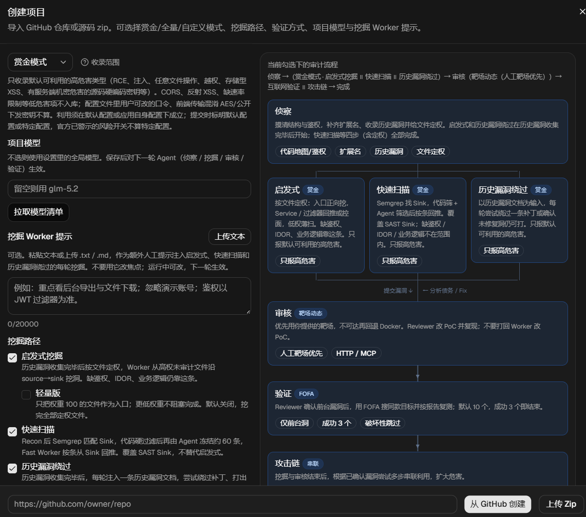
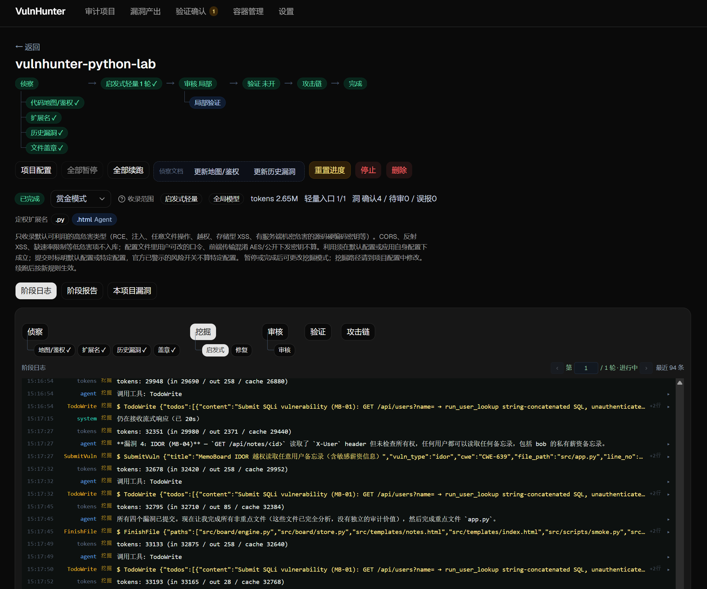
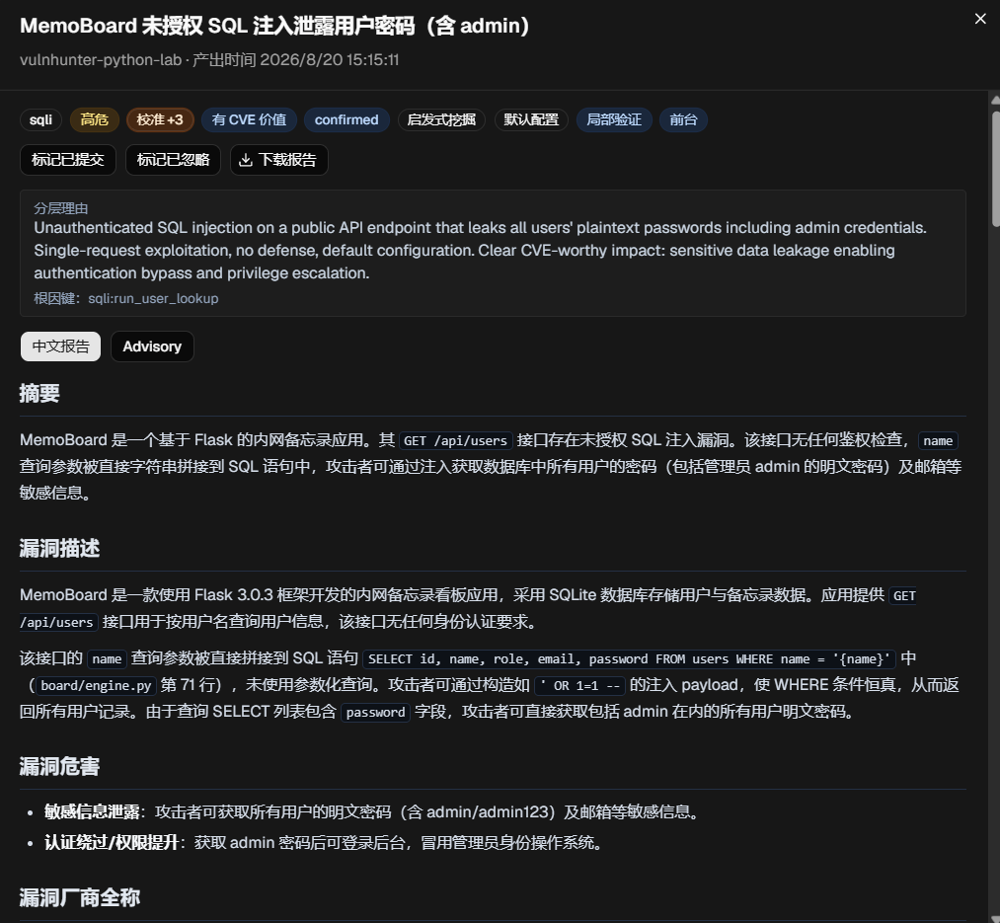

# VulnHunter

白盒审计 Agent：导入 GitHub / zip Web 项目，Recon（含历史漏洞）→ 启发式 Worker（历史漏洞收集完毕后）和/或快速扫描和/或历史漏洞绕过 → Reviewer 审核（默认仅静态；可选靶场动态先跑 HTTP PoC，或局部验证用沙箱 harness）；可选 Verifier 对已确认前台漏洞做 FOFA 互联网复测；可选攻击链串联。

Windows 用根目录 `start.cmd` / `stop.cmd`；**Linux / macOS** 用 `sh start.sh` / `sh stop.sh`。

## 功能简介

VulnHunter-White的特点是，支持三种挖掘模式，通过docker动态验证漏洞，并允许测试互联网目标，且最终会对挖掘到的漏洞进行攻击链串联。

创建任务页面如下，允许通过github链接或上传zip开始审计：




任务详情页面如下，支持SSE实时日志，查看每轮的阶段报告，对项目进行动态配置修改等：




互联网验证确认页面如下，允许用户对可能产生危害的漏洞进行人工干预，实现Human in Loop：


漏洞产出页面如下，对漏洞进行详细打标，包括验证形式（静态、动态、局部），权限（前台、后台），互联网复现情况：





容器管理页面，可监测项目在动态复现时，启动了哪些容器：


设置页面，支持Chat Completions和Anthropic Message格式，支持添加自定义挖掘提示词用于限定漏洞种类，支持清理日志：（当前模型商只测试过GLM、DeepSeek、百炼）


## 环境要求

按你要用的功能装，不必一次全装。**只打开 UI、做静态审核**时，装「必需」即可。

### 必需（启动前后端）

| 软件 | 版本 | 说明 |
| --- | --- | --- |
| 操作系统 | Windows 10 / 11，或 Linux / macOS | Windows：`start.cmd`。Linux/macOS：`sh start.sh`（POSIX `sh`，不依赖 bash） |
| Python | **3.11+**（推荐 **3.12** 64-bit） | Windows 需能执行 `python`（勾选 PATH，带 `venv`）。Unix 优先 `python3`。Debian/Ubuntu 另装 `python3-venv` |
| Node.js | **20 LTS**（最低 18） | 需能执行 `node`、`npm`；前端 Vite 6 需要较新 Node |
| Git | 2.x | 从 GitHub 导入仓库时 `git clone --depth 1`；只上传 zip 也可不装，但建议装上 |
| 空闲端口 | **8000**、**5173** | 后端 API / 前端开发服务器；被占用时先 `stop.cmd` / `sh stop.sh` |
| LLM 接口 | 兼容 OpenAI Chat Completions 或 Anthropic Messages | 启动后在设置页填 Base URL、API Key、模型；没有模型无法跑 Agent |

启动前在仓库外任意终端确认：

```bat
python --version
node --version
npm --version
git --version
```

Linux / macOS 把第一行换成 `python3 --version`。Windows 上 `python` 应打印 `3.11` 或 `3.12`，不要落到 Windows Store 的占位 `python.exe`（那种会弹安装商店而建不成 venv）。

### 按功能可选

| 功能 | 需要 | 没有时的行为 |
| --- | --- | --- |
| 从 GitHub 导入公开仓 | Git | 导入失败 |
| 导入私有仓 / 提高 GHSA、Issues 配额 | 设置页 **GitHub PAT** | 公开仓仍可 clone；GitHub API 更容易撞匿名限额 |
| 靶场动态验证（Reviewer 搭 Docker 靶场并跑 `poc.py`） | **Docker** 已启动（Desktop 或 Linux 引擎），且能执行 `docker version` | 环境轮会 skip；靶场不可用时无法按动态证据确认 |
| 局部验证（沙箱跑 harness） | Docker + 下文构建的 `vulnhunter/sandbox:latest` | 退回静态，不因此判误报 |
| 快速扫描（Semgrep → Sink 回推） | 本机 `semgrep` **或** Docker（会拉 `returntocorp/semgrep:latest`） | 该路径无法跑 |
| Verifier（FOFA 互联网复测） | 设置页 **FOFA Key**（或环境变量 `VULNHUNTER_FOFA_KEY`） | 验证轮会 skip |
| 出站走代理（WebSearch / GitHub / FOFA） | 设置页 HTTP 代理，或 `.env` 里 `VULNHUNTER_HTTP_PROXY` | 直连；连不上时代理会自动改直连 |
| Chat 走代理 | 设置页 Chat 代理，或 `VULNHUNTER_CHAT_PROXY` | Chat 默认直连，与工具代理分开 |
| Java 靶场改写 PoC 时用 debug MCP | **JDK 17+**、**Maven 3.6+**，并 `mvn package` | 仍可用 HTTP PoC + `docker exec`，只是不能 attach Java 调试器 |
| Node 靶场 debug MCP | 已装 Node；在 `tools/mcp/node-debug` 执行 `npm install` | 同上，走普通动态 |
| Python 靶场 debug MCP | 在后端 venv 中安装 `mcp`、`debugpy` | 同上 |

Docker 相关功能还要求：

- Docker **正在运行**（Windows / Mac 上为 Docker Desktop 托盘已启动；Linux 上为 docker 服务已起来），不只是装过。Windows 上通常走 WSL2 后端。
- 当前用户能无交互执行 `docker ps`（不必每次 sudo / 管理员密码）。
- 磁盘留足空间：沙箱镜像、Semgrep 镜像、以及每个审计项目自建的 lab 镜像都会占空间。

## 启动前要做的构建

`start.cmd` / `start.sh` **只会**在首次运行时创建后端 venv、`pip install` 和前端 `npm install`。下面几项**不会**自动做，按你要用的功能提前做完。

### 1. 拿到源码

```bat
git clone <本仓库 URL>
cd VulnHunter
```

### 2. 后端 Python 依赖（`start.cmd` / `start.sh` 首次会做）

手动做一次也可以，便于提前暴露缺 Python / pip 问题。

Windows：

```bat
cd backend
python -m venv .venv
.venv\Scripts\activate
pip install -r requirements.txt
cd ..
```

Linux / macOS：

```sh
cd backend
python3 -m venv .venv
. .venv/bin/activate
pip install -r requirements.txt
cd ..
```

### 3. 前端 Node 依赖（`start.cmd` / `start.sh` 首次会做）

```bat
cd frontend
npm install
cd ..
```

国内网络慢时，`start.cmd` / `start.sh` 的后端依赖默认使用 `https://pypi.tuna.tsinghua.edu.cn/simple`（可用 `VULNHUNTER_PIP_INDEX_URL` 覆盖；失败会回退默认源），前端依赖默认使用 `https://registry.npmmirror.com`。手动安装也可：

```bat
cd frontend
npm install --registry=https://registry.npmmirror.com
```

### 4. 局部验证沙箱镜像（要用「局部验证」时必做）

Docker 启动后，在仓库根目录：

```bat
scripts\build-sandbox.cmd
```

Linux / macOS：`sh scripts/build-sandbox.sh`。

等价于：

```bat
docker build -t vulnhunter/sandbox:latest docker/sandbox
```

成功后 `docker images` 里应有 `vulnhunter/sandbox:latest`。镜像不存在时局部验证无法起沙箱，会退回静态。

### 5. Debug MCP（仅靶场动态 + 需要改写/调试 PoC 时）

源码在 `tools/mcp/`，路径相对仓库根。未构建时 Reviewer 仍走普通动态（当前 HTTP PoC + docker exec）。PoC 由 Reviewer 收口；只有缺失、跑不通或复现失败且需自己改写时才 attach。详见 `tools/mcp/README.md`。

**Java**（JDK 17+、Maven 3.6+）：

```bat
cd tools\mcp\java-debug
mvn package
```

需要生成 `target\java-debug-mcp-0.1.0-SNAPSHOT-all.jar`。没有这个 jar 时 Java MCP 不可用。

**Node**：

```bat
cd tools\mcp\node-debug
npm install
```

运行时由后端以 `npx tsx src/index.ts` 拉起，需能访问 npm 以获取 `tsx`。

**Python**（装进**后端 venv**，因为启动脚本会用这个解释器跑后端）：

```bat
backend\.venv\Scripts\pip.exe install mcp debugpy
```

Linux / macOS：`backend/.venv/bin/pip install mcp debugpy`。

或：

```bat
backend\.venv\Scripts\pip.exe install -e tools\mcp\python-debug
```

Unix：`backend/.venv/bin/pip install -e tools/mcp/python-debug`。

可用环境变量覆盖 MCP 目录：`VULNHUNTER_MCP_JAVA` / `VULNHUNTER_MCP_NODE` / `VULNHUNTER_MCP_PYTHON`（相对仓库根或绝对路径）。构建产物（`target/`、`node_modules/`、`dist/`）不要提交。

### 6. 快速扫描用的 Semgrep

二选一即可：

- 本机安装 `semgrep`，保证 `semgrep --version` 可用；或
- 安装并启动 Docker。首次跑快速扫描时会拉取 `returntocorp/semgrep:latest`（体积较大，需能访问镜像仓库）。

### 7. 可选环境变量

可将 `.env.example` 复制为仓库根或 `backend/.env`。设置页保存过代理 / FOFA 后以设置为准；**尚未保存过**时才用这些变量回退。不要把真实 Key 写进仓库。

```
VULNHUNTER_HTTP_PROXY=
VULNHUNTER_HTTPS_PROXY=
VULNHUNTER_CHAT_PROXY=
VULNHUNTER_FOFA_KEY=
GITHUB_TOKEN=
```

`OPENAI_API_KEY` 也可作回退，日常请在设置页填写。

## 一键启停

**Windows**（仓库根目录双击，或 CMD）：

```bat
start.cmd
```

**Linux / macOS**：

```sh
sh start.sh
```

若已 `chmod +x start.sh`，也可 `./start.sh`。脚本是 POSIX `sh`，macOS 自带 `/bin/sh` 即可，不必装 bash。

- 启动后端 `http://127.0.0.1:8000` 与前端 `http://127.0.0.1:5173`
- 首次自动建 `backend/.venv`、安装 Python 依赖、在 `frontend` 执行 `npm install`
- 默认不热更新；改后端代码时用 `start.cmd --reload` 或 `sh start.sh --reload`
- 约 45 秒内检测 8000 / 5173 是否在听；超时会提示去看日志，不一定是失败
- Unix 会把 PID 写到 `data/run/backend.pid`、`data/run/frontend.pid`

停止：

```bat
stop.cmd
```

```sh
sh stop.sh
```

Windows 按窗口标题结束进程并释放 8000、5173；Linux/macOS 按 PID 文件 + 端口结束。

日志：`data/logs/backend.log`、`data/logs/frontend.log`。端口一直没起来时先看这两份文件。

启动成功后浏览器打开 **http://127.0.0.1:5173** 。API 文档：http://127.0.0.1:8000/docs 。

### 首次打开：设置页

不配模型就无法创建并跑审计项目。打开 UI 后先到「设置」：

1. 选择接口协议：OpenAI **Chat Completions**（默认）或 **Anthropic Messages**
2. 填写 **API Base URL**、**API Key**、默认**模型**（可先点拉取模型列表再保存）
3. 可选：GitHub PAT（私有仓、提高 GHSA / Issues 限额）
4. 若要开 Verifier：再填 **FOFA Key**（也可用 `VULNHUNTER_FOFA_KEY`）
5. 可选：出站 HTTP 代理、Chat 代理；留空则直连，不再默认走 `10808`

保存后再新建审计项目。

## 手动启动

一键脚本不可用，或要分开调试前后端时用。先完成上文「启动前要做的构建」里的第 2、3 步。

### 后端

Windows：

```bat
cd backend
.venv\Scripts\activate
uvicorn app.main:app --reload --reload-dir app --timeout-graceful-shutdown 2 --host 127.0.0.1 --port 8000
```

Linux / macOS：

```sh
cd backend
. .venv/bin/activate
uvicorn app.main:app --reload --reload-dir app --timeout-graceful-shutdown 2 --host 127.0.0.1 --port 8000
```

`--timeout-graceful-shutdown 2` 不要去掉：SSE 长连接会让热加载卡在 Waiting for connections to close。

### 前端

```bat
cd frontend
npm run dev
```

开发服务器把 `/api` 代理到 `127.0.0.1:8000`，请同时开着后端。

## 常见启动问题

| 现象 | 处理 |
| --- | --- |
| `python` 不是内部或外部命令 / 打开微软商店 | 安装 64-bit Python 3.12，勾选 PATH；关掉应用执行别名里的 `python.exe` |
| Unix：`need Python 3.11+` | 安装 3.11/3.12；Debian/Ubuntu：`sudo apt install python3 python3-venv python3-pip`；macOS：`brew install python@3.12` |
| `creating backend venv` 失败 | 确认 `python -m venv --help` / `python3 -m venv --help` 可用；杀毒软件不要锁 `backend/.venv` |
| `npm` 失败或极慢 | 换 Node 20 LTS；用 npmmirror；删掉不完整的 `frontend/node_modules` 再装 |
| `warn: ports not ready` | 看 `data/logs/`；常见是 8000/5173 被旧进程占用，先 `stop.cmd` / `sh stop.sh` |
| 页面能开但接口全失败 | 后端没起来，或前端不是 5173（没走到 Vite 代理） |
| GitHub 导入失败 | 确认 `git` 在 PATH；私有仓填 PAT；公司代理填设置页 HTTP 代理 |
| 靶场 / 容器页提示 docker unavailable | 打开 Docker Desktop 或启动 docker 服务，等引擎就绪后再试 `docker ps` |
| 局部验证说镜像不存在 | 重新执行 `scripts\build-sandbox.cmd` 或 `sh scripts/build-sandbox.sh` |
| 快速扫描报未找到 semgrep | 安装本机 semgrep，或保证 Docker 可用并允许拉镜像 |
| Java MCP 无效果 | 确认已 `mvn package` 且 jar 存在；`java -version` 为 17+ |
| `/bin/sh^M: bad interpreter` 或 `\r: command not found` | 脚本被存成了 CRLF。仓库已设 `*.sh text eol=lf`；执行 `git add --renormalize '*.sh'` 后再检出，或 `sed -i 's/\r$//' start.sh stop.sh scripts/*.sh` |

## 单元测试

Windows：

```bat
cd backend
.venv\Scripts\activate
pip install -r requirements.txt
pytest
```

或运行 `scripts\run-tests.cmd`。

Linux / macOS：

```sh
cd backend
. .venv/bin/activate
pip install -r requirements.txt
pytest
```

或 `sh scripts/run-tests.sh`。覆盖：漏洞类型、看门狗、上下文压缩/429 识别、沙箱、入库索引、工具 ACL/门闩、API、环境端口重映射等。

## 能力概览

- 凡 Web 项目均可审计（不限语言）
- 创建项目时选择赏金模式（默认）、全量模式或自定义模式，并可勾选挖掘路径：启发式（默认开，可再开轻量版只挖权重 100）、快速扫描（默认关）和/或历史漏洞绕过（默认关），至少开一条。每个项目可单独选择模型，不选则使用设置页全局模型。可在项目配置中粘贴或上传文本，作为挖掘 Worker 的额外人工提示，注入每轮启发式 / 快速扫描 / 历史漏洞绕过
- 启发式在历史漏洞收集完毕后按文件定权挖掘：权重 100 为用户可控入口（HTTP 以及 WebSocket / RPC / MQ / 回调等）；更低权按角色回推、控面或薄扫。可勾选轻量版，只把权重 100 的文件当入口。快速扫描在 Recon 后用 Semgrep 找 Sink，经代码筛和短 Agent 筛选后按条回推。快速路径覆盖 SAST Sink，缺鉴权/IDOR/业务逻辑仍靠启发式。历史漏洞绕过以收集到的历史漏洞文档为输入，每轮尝试绕过一条补丁或确认未修复洞仍可打。开启的路径都结束后项目才 completed
- 设置页可管理命名自定义审计模式提示词；内置赏金/全量提示词只读可复制。项目选用自定义时写入快照，改库不影响已绑定项目
- 赏金模式按可利用高危害类型收口（含存储型 XSS、有服务端机密危害的源码硬编码密钥；前端传输混淆 AES / 公开下发密钥不入库）；全量模式保留低危害难利用项（CORS、反射 XSS、缺速率限制等）；自定义模式无赏金硬闸门，完全按提示词判定
- 可选动态验证：创建项目时默认关闭（只做静态复核）。勾选后 Reviewer 才搭建 Docker 靶场，并先跑当前 HTTP PoC（`poc.py -u` + docker exec/日志）复现；靶场可用时 ConfirmVuln 会系统再跑一遍落盘 `poc.py`，退出码非 0 则拒绝确认。PoC 由 Reviewer 收口，不要打回 Worker 改 PoC。PoC 缺失、跑不通或复现失败且需自己改写时，才用 Java/Node/Python debug MCP 动态调试。Worker / Reviewer 的 `poc.py` 用 `-u/--url` 对任意目标复测，必须支持 `--proxy` 设 HTTP 代理（空则直连），RCE 支持 `-c/--cmd` 并打印回显。自建镜像 `{项目名}-{项目ID}:lab`，Web 容器 `{项目名}-{项目ID}`，依赖容器加 `-{role}`
- 可选 Verifier：创建项目时默认关闭，也可在项目设置中开启。Reviewer 确认前台漏洞后，用 FOFA 默认搜 10 个同款目标并按报告复测，成功 3 个即结束；当前这批不足 3 个则保留已成功的并再搜下一轮，最多 5 轮（合计最多 50 个目标）。应用指纹按项目采集一次（标题/默认页 HTML 特征 + 互联网检索）并复用；FOFA 有命中后共享，0 条可改写最多 3 次（title/app 与 `body=` 各试一条）。报告会列出全部目标并标注成功 / 失败 / 未测，复现成功须附上搜索语法。任意文件删除、DoS、SQL 增删改等会中断或篡改业务的漏洞不测互联网目标
- 可选攻击链串联：创建时默认关闭，可在项目设置中开启。挖掘完成且审核队列清空后，根据已确认漏洞尝试多步利用
- LLM 报错对齐 AutoPoc：429 休眠续跑、超时 conclude、死循环新开、阶段最多再试 2 次
- 全局 LLM 总线程数默认 6：所有运行中项目的侦察 / 挖掘 / 审核等会话合计占用，超出排队顺序放行
- 设置页可手动清理 X 天前的实时日志（SSE）
- 设置页可指定 CLI 工具目录（默认 `tools/cli`，一子目录一工具）。后台轮询静默索引后，Reviewer 用 `SearchTools` 查路径与描述，再用 Shell 按绝对路径执行
- 历史漏洞：先 GHSA / GitHub Issues 爬虫交给 Agent 落盘（第一阶段禁止 WebSearch），再 WebSearch 补漏；阶段只收集不读源码。公开洞标 `patched`，未修复仅来自未关闭 GitHub Issues（`unpatched`）
- 可重置启发式 Worker 挖掘进度（保留漏洞产出与侦察文档），用于更换模型重审启发式路径。快速扫描 Sink 队列与历史漏洞绕过进度不重置

## 目录

- `backend/app` — FastAPI、Agent 循环、工具、调度
- `frontend` — React + Tailwind UI
- `templates` — 文档模板
- `tools/mcp` — Java / Node / Python debug MCP
- `tools/cli` — 用户放置的 CLI 工具（一目录一工具；Reviewer SearchTools）
- `docker/sandbox` — 局部验证沙箱镜像
- `scripts` — 启停、测试、构建沙箱
- `data/projects/{id}` — 项目隔离工作区（运行态，不要提交）
