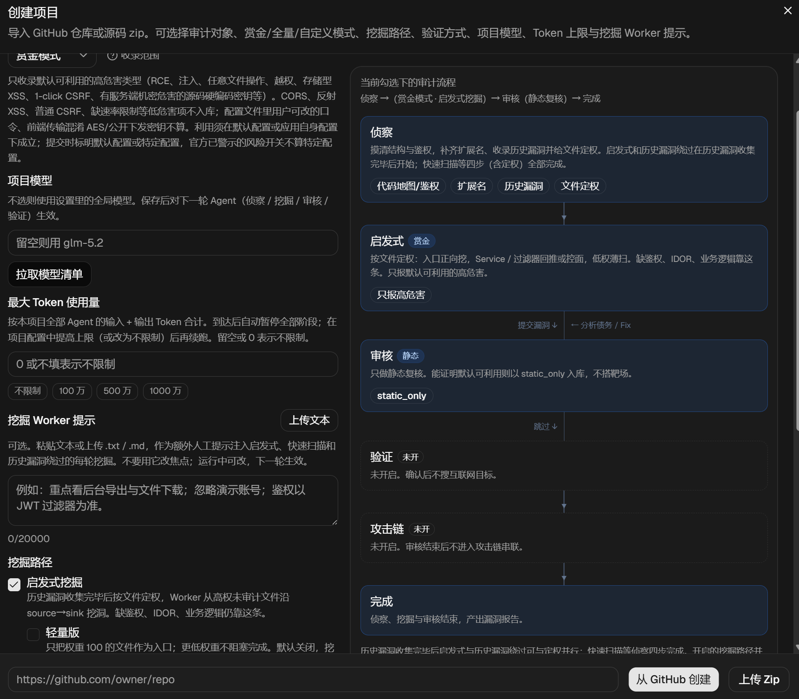
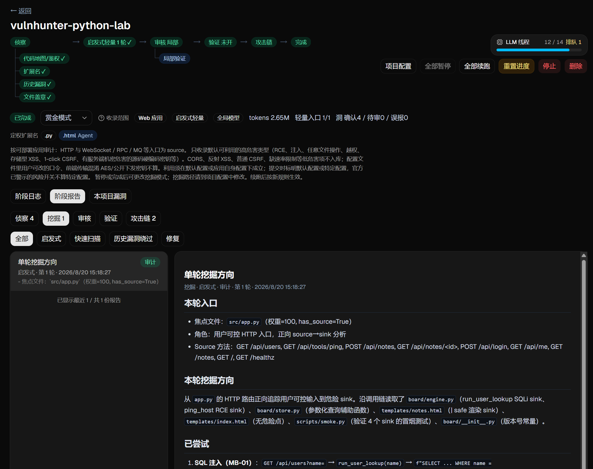
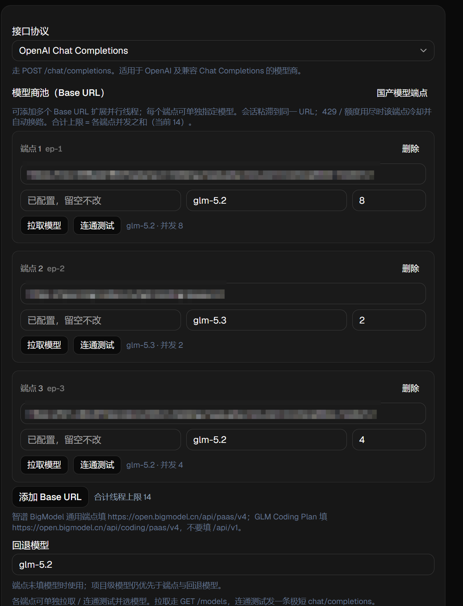
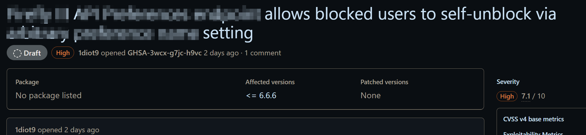
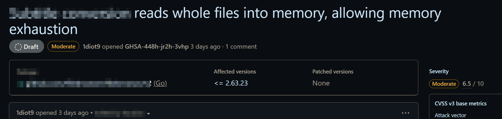
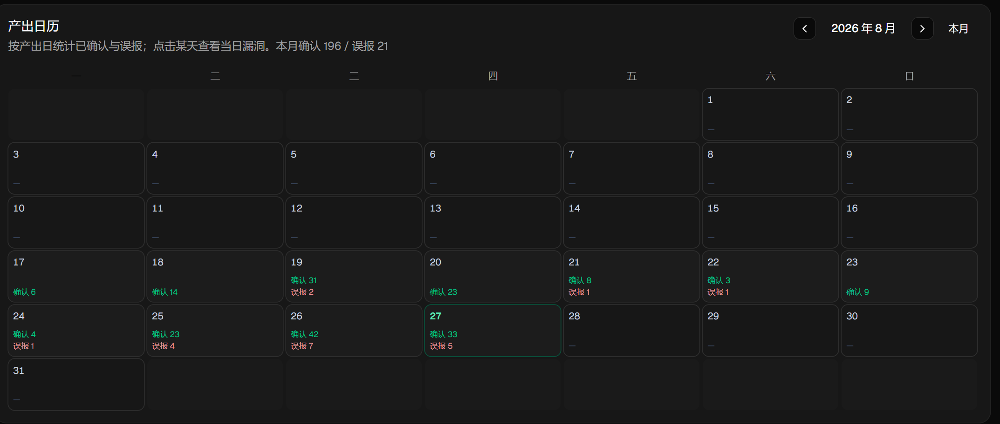

# VulnHunter-White

特别感谢 [DeepAudit](https://github.com/lintsinghua/DeepAudit) 和 [AutoCVE](https://github.com/larlarua/AutoCVE) 这两个项目，给本项目提供了很多思路，尤其是前期开发时。

白盒审计 Agent 平台：导入 GitHub 仓库或源码 zip，经多角色流水线完成漏洞挖掘、审核与可选互联网验证。

**流水线概要**：Recon（代码地图、鉴权、历史漏洞、文件定权）完成后开始挖掘；创建时可勾选代码库（CodeGraph 源码图，默认关），开启后与 Recon 并列、都完成后才挖掘 → 启发式 / 快速扫描 / 历史漏洞绕过 / 无约束扫描（至少一条）→ Reviewer（默认静态；可选靶场动态或局部 harness）→ 可选 Verifier（FOFA）与攻击链串联。

**设计文档**（架构、阶段设计、容错机制、创新点）：[`docs/DESIGN.md`](docs/DESIGN.md)

Windows 用根目录 `start.cmd` / `stop.cmd`；**Linux / macOS** 用 `sh start.sh` / `sh stop.sh`。

本项目暂不支持Docker部署，需要自行构建完毕后启动，构建步骤详见[启动前要做的构建](#启动前要做的构建)

## 目录索引

- [功能简介](#功能简介)
- [环境要求](#环境要求)
  - [必需（启动前后端）](#必需启动前后端)
  - [按功能可选](#按功能可选)
- [启动前要做的构建（必看）](#启动前要做的构建)
  - [1. 拿到源码](#1-拿到源码)
  - [2. 后端 Python 依赖](#2-后端-python-依赖startcmd--startsh-首次会做)
  - [3. 前端 Node 依赖](#3-前端-node-依赖startcmd--startsh-首次会做)
  - [4. 局部验证沙箱镜像（L1/L2 harness）](#4-局部验证沙箱镜像l1l2-harness要用局部验证时必做)
  - [5. 集成验证沙箱镜像（L3 integration）](#5-集成验证沙箱镜像l3-integration要用-l3-集成验证时必做)
  - [6. Debug MCP](#6-debug-mcp仅靶场动态--需要改写调试-poc-时)
  - [7. 快速扫描用的 Semgrep](#7-快速扫描用的-semgrep)
  - [8. 可选环境变量](#8-可选环境变量)
- [一键启停](#一键启停)
  - [首次打开：设置页](#首次打开设置页)
- [手动启动](#手动启动)
  - [后端](#后端)
  - [前端](#前端)
- [常见启动问题](#常见启动问题)
- [单元测试](#单元测试)
- [能力概览](#能力概览)
- [仓库目录](#目录)
- [设计文档](#设计文档)
- [成果展示](#成果展示)

## 功能简介

VulnHunter-White 的特点：

- 支持**赏金 / 全量 / 自定义**三种挖掘模式
- 支持**Web 应用 / 组件库 / 混合**三种审计对象（`target_kind`，与挖掘模式正交）
- 支持**靶场动态**、**局部 harness**、**纯静态**三种审核验证方式
- 可选 **FOFA 互联网验证**与 **Human-in-the-loop** 确认
- 挖掘与审核结束后可选**攻击链串联**
- 设置页可配**模型商池**；每项目可设 Token 用量上限；可从公开 GHSA **发现仓库**
- 漏洞产出含**产出日历**、中文报告 / Advisory / CVE JSON

创建任务页面：通过 GitHub 链接或上传 zip 开始审计，支持设定最大Token用量。





任务详情页面：SSE 实时日志、阶段报告、运行中动态配置。允许实时注入用户指令；各小阶段可接续或新开，无约束扫描为停止 / 启动。




互联网验证确认页面：对可能产生危害的漏洞进行人工干预。


漏洞产出页面：验证形式（静态 / 动态 / 局部）、权限（前台 / 后台）、互联网复现情况。报告支持普通格式、advisory格式、CVE Json格式。可追问报告。产出日历按日统计已确认与误报。


容器管理页面：监测动态复现时启动的容器。


设置页面：Chat Completions / Anthropic Messages、自定义挖掘提示词、日志清理等，支持设置多个服务商作为LLM池（当前模型商主要测试过 GLM、DeepSeek、百炼）




发现仓库页面：从公开 GHSA 筛可审计仓库，已创建与可创建分开列出。

## 环境要求

按你要用的功能装，不必一次全装。**只打开 UI、做静态审核**时，装「必需」即可。

### 必需（启动前后端）

| 软件 | 版本 | 说明 |
| --- | --- | --- |
| 操作系统 | Windows 10 / 11，或 Linux / macOS | Windows：`start.cmd`。Linux/macOS：`sh start.sh`（POSIX `sh`，不依赖 bash） |
| Python | **3.11+**（推荐 **3.12** 64-bit） | Windows 需能执行 `python`（勾选 PATH，带 `venv`）。Unix 优先 `python3`。Debian/Ubuntu 另装 `python3-venv` |
| Node.js | **20 LTS**（最低 18） | 需能执行 `node`、`npm`；前端 Vite 6 需要较新 Node |
| Git | 2.x | 从 GitHub 导入仓库时 `git clone --depth 1`（Windows 会带 `core.longpaths`，避免 XWiki 等深层路径 `Filename too long`）；只上传 zip 也可不装，但建议装上 |
| 空闲端口 | **16780**、**15173** | 后端 API / 前端开发服务器；被占用时用 `--backend-port` / `--frontend-port` 换端口，或先 `stop.cmd` / `sh stop.sh` |
| LLM 接口 | 兼容 OpenAI Chat Completions 或 Anthropic Messages | 启动后在设置页填 Base URL、API Key、模型；没有模型无法跑 Agent |

启动前在仓库外任意终端确认：

```bat
python --version
node --version
npm --version
git --version
```

Linux / macOS 把第一行换成 `python3 --version`。Windows 上 `python` 应打印 `3.11` 或 `3.12`，不要落到 Windows Store 的占位 `python.exe`（那种会弹安装商店而建不成 venv）。

### 按功能可选

| 功能 | 需要 | 没有时的行为 |
| --- | --- | --- |
| 从 GitHub 导入公开仓 | Git | 导入失败 |
| 导入私有仓 / 提高 GHSA、Issues 配额 | 设置页 **GitHub PAT** | 公开仓仍可 clone；GitHub API 更容易撞匿名限额 |
| 靶场动态验证（Reviewer 搭 Docker 靶场并跑 `poc.py`） | **Docker** 已启动（Desktop 或 Linux 引擎），且能执行 `docker version` | 环境轮会 skip；靶场不可用时无法按动态证据确认 |
| 局部验证（L1/L2：沙箱跑 harness） | Docker + 下文构建的 `vulnhunter/sandbox:latest` | 退回静态，不因此判误报 |
| 局部验证 L3 集成验证（起 loopback 服务并跑 `poc.py`，通过后升为动态证据） | Docker + 下文构建的 `vulnhunter/integration-sandbox:latest` | 无法自动跑 L3；可写 `env/env.json` 的 `local_service_url` 走本机 fallback |
| 快速扫描（Semgrep → Sink 回推） | 本机 `semgrep` **或** Docker（会拉 `returntocorp/semgrep:latest`） | 该路径无法跑 |
| 代码库（调用图查询） | 创建项目时勾选；本机 `codegraph`，或设置页路径 / `VULNHUNTER_CODEGRAPH_PATH` | 未勾选则不建图、不占磁盘，挖掘只等侦察。勾选后构建阶段自动装到 `data/tools/codegraph`；仍失败则降级为 Read/Grep，不阻塞挖掘 |
| Verifier（FOFA 互联网复测） | 设置页 **FOFA Key**（或环境变量 `VULNHUNTER_FOFA_KEY`） | 验证轮会 skip |
| 出站走代理（WebSearch / GitHub / FOFA） | 设置页 HTTP 代理，或 `.env` 里 `VULNHUNTER_HTTP_PROXY` | 直连；连不上时代理会自动改直连 |
| Chat 走代理 | 设置页 Chat 代理，或 `VULNHUNTER_CHAT_PROXY` | Chat 默认直连，与工具代理分开 |
| 全局访问令牌 | `.env` 的 `VULNHUNTER_ACCESS_TOKEN`，或设置页 | 未配置则不启用入口闸门，打开即可用 |
| Java 靶场改写 PoC 时用 debug MCP | **JDK 17+**、**Maven 3.6+**，并 `mvn package` | 仍可用 HTTP PoC + `docker exec`，只是不能 attach Java 调试器 |
| Node 靶场 debug MCP | 已装 Node；在 `tools/mcp/node-debug` 执行 `npm install` | 同上，走普通动态 |
| Python 靶场 debug MCP | 在后端 venv 中安装 `mcp`、`debugpy` | 同上 |

Docker 相关功能还要求：

- Docker **正在运行**（Windows / Mac 上为 Docker Desktop 托盘已启动；Linux 上为 docker 服务已起来），不只是装过。Windows 上通常走 WSL2 后端。
- 当前用户能无交互执行 `docker ps`（不必每次 sudo / 管理员密码）。
- 磁盘留足空间：harness / integration 沙箱镜像、Semgrep 镜像、以及每个审计项目自建的 lab 镜像都会占空间。

## 启动前要做的构建

`start.cmd` / `start.sh` **只会**在首次运行时创建后端 venv、`pip install` 和前端 `npm install`。下面几项**不会**自动做，按你要用的功能提前做完。

### 1. 拿到源码

```bat
git clone <本仓库 URL>
cd VulnHunter
```

### 2. 后端 Python 依赖（`start.cmd` / `start.sh` 首次会做）

手动做一次也可以，便于提前暴露缺 Python / pip 问题。

Windows：

```bat
cd backend
python -m venv .venv
.venv\Scripts\activate
pip install -r requirements.txt
cd ..
```

Linux / macOS：

```sh
cd backend
python3 -m venv .venv
. .venv/bin/activate
pip install -r requirements.txt
cd ..
```

### 3. 前端 Node 依赖（`start.cmd` / `start.sh` 首次会做）

```bat
cd frontend
npm install
cd ..
```

国内网络慢时，`start.cmd` / `start.sh` 的后端依赖默认使用 `https://pypi.tuna.tsinghua.edu.cn/simple`（可用 `VULNHUNTER_PIP_INDEX_URL` 覆盖；失败会回退默认源），前端依赖默认使用 `https://registry.npmmirror.com`。手动安装也可：

```bat
cd frontend
npm install --registry=https://registry.npmmirror.com
```

### 4. 局部验证沙箱镜像（L1/L2 harness，要用「局部验证」时必做）

用于 **L1（函数/mock）** 与 **L2（模块链）** 的 `RunCode` harness。Docker 启动后，在仓库根目录：

```bat
scripts\build-sandbox.cmd
```

Linux / macOS：`sh scripts/build-sandbox.sh`。

等价于：

```bat
docker build -t vulnhunter/sandbox:latest docker/sandbox
```

成功后 `docker images` 里应有 `vulnhunter/sandbox:latest`。镜像不存在时局部验证无法起 harness 沙箱，会退回静态。

### 5. 集成验证沙箱镜像（L3 integration，要用 L3 集成验证时必做）

用于 **L3 集成验证**：在容器内临时安装依赖、起 `127.0.0.1` 上的 loopback 服务并跑 `poc.py`；通过后证据升为**动态验证**（无需 Docker 靶场镜像）。仅做 L1/L2 可不构建本镜像。

Docker 启动后，在仓库根目录：

```bat
scripts\build-integration-sandbox.cmd
```

Linux / macOS：`sh scripts/build-integration-sandbox.sh`。

等价于：

```bat
docker build -t vulnhunter/integration-sandbox:latest docker/integration-sandbox
```

成功后 `docker images` 里应有 `vulnhunter/integration-sandbox:latest`。镜像不存在时 L3 无法走沙箱路径；若已在 `data/projects/{id}/env/env.json` 配置 loopback 的 `local_service_url`，可退回本机跑 `poc.py`（仍须 `127.0.0.1` / `localhost`）。

### 6. Debug MCP（仅靶场动态 + 需要改写/调试 PoC 时）

源码在 `tools/mcp/`，路径相对仓库根。未构建时 Reviewer 仍走普通动态（当前 HTTP PoC + docker exec）。PoC 由 Reviewer 收口；只有缺失、跑不通或复现失败且需自己改写时才 attach。详见 `tools/mcp/README.md`。

**Java**（JDK 17+、Maven 3.6+）：

```bat
cd tools\mcp\java-debug
mvn package
```

需要生成 `target\java-debug-mcp-0.1.0-SNAPSHOT-all.jar`。没有这个 jar 时 Java MCP 不可用。

**Node**：

```bat
cd tools\mcp\node-debug
npm install
```

运行时由后端以 `npx tsx src/index.ts` 拉起，需能访问 npm 以获取 `tsx`。

**Python**（装进**后端 venv**，因为启动脚本会用这个解释器跑后端）：

```bat
backend\.venv\Scripts\pip.exe install mcp debugpy
```

Linux / macOS：`backend/.venv/bin/pip install mcp debugpy`。

或：

```bat
backend\.venv\Scripts\pip.exe install -e tools\mcp\python-debug
```

Unix：`backend/.venv/bin/pip install -e tools/mcp/python-debug`。

可用环境变量覆盖 MCP 目录：`VULNHUNTER_MCP_JAVA` / `VULNHUNTER_MCP_NODE` / `VULNHUNTER_MCP_PYTHON`（相对仓库根或绝对路径）。构建产物（`target/`、`node_modules/`、`dist/`）不要提交。

### 7. 快速扫描用的 Semgrep

二选一即可：

- 本机安装 `semgrep`，保证 `semgrep --version` 可用；或
- 安装并启动 Docker。首次跑快速扫描时会拉取 `returntocorp/semgrep:latest`（体积较大，需能访问镜像仓库）。

### 8. 可选环境变量

可将 `.env.example` 复制为仓库根或 `backend/.env`。监听端口给 `start.cmd` / `start.sh` 用；设置页保存过代理 / FOFA 后以设置为准，**尚未保存过**时才用代理 / Key 变量回退。不要把真实 Key 写进仓库。

```
# VULNHUNTER_ACCESS_TOKEN=
# VULNHUNTER_PORT=16780
# VULNHUNTER_FRONTEND_PORT=15173
# VULNHUNTER_HOST=127.0.0.1
VULNHUNTER_HTTP_PROXY=
VULNHUNTER_HTTPS_PROXY=
VULNHUNTER_CHAT_PROXY=
VULNHUNTER_FOFA_KEY=
GITHUB_TOKEN=
# VULNHUNTER_CODEGRAPH_PATH=
# VULNHUNTER_JADX_PATH=
```

`VULNHUNTER_ACCESS_TOKEN` 为全局访问令牌：配置后打开前端需先输入才能查看数据或调用功能；也可在设置页用当前令牌修改（修改后以设置为准）。未配置则不启用入口闸门。`OPENAI_API_KEY` 也可作回退，日常请在设置页填写。`VULNHUNTER_HOST` 默认 `127.0.0.1`（仅本机）；局域网访问设 `0.0.0.0` 或启动时加 `--lan`。

## 一键启停

**Windows**（仓库根目录双击，或 CMD）：

```bat
start.cmd
```

**Linux / macOS**：

```sh
sh start.sh
```

若已 `chmod +x start.sh`，也可 `./start.sh`。脚本是 POSIX `sh`，macOS 自带 `/bin/sh` 即可，不必装 bash。

- 启动后端 `http://127.0.0.1:16780` 与前端 `http://127.0.0.1:15173`（避开常见的 8000 / Vite 5173）；默认只绑本机
- 局域网访问：`start.cmd --lan` 或 `start.cmd --host 0.0.0.0`（Unix：`sh start.sh --lan`），也可设环境变量 `VULNHUNTER_HOST=0.0.0.0`
- 可用 `start.cmd --backend-port 19000 --frontend-port 19001`（Unix：`sh start.sh --backend-port 19000 --frontend-port 19001`）或环境变量 `VULNHUNTER_PORT` / `VULNHUNTER_FRONTEND_PORT` 换端口
- 首次自动建 `backend/.venv`、安装 Python 依赖、在 `frontend` 执行 `npm install`
- 默认不热更新；改后端代码时用 `start.cmd --reload` 或 `sh start.sh --reload`
- 启动前会先停掉本仓库上一份实例。若目标端口仍被**其他程序**占用，脚本直接报错退出，不会自动改端口
- 约 45 秒内检测所选端口是否在听；超时会提示去看日志，不一定是失败
- Unix 会把 PID 写到 `data/run/backend.pid`、`data/run/frontend.pid`；本次端口写入 `data/run/ports.env` 供 `stop` 使用

停止：

```bat
stop.cmd
```

```sh
sh stop.sh
```

Windows 按窗口标题结束进程，并释放上次记录的端口（以及默认 16780 / 15173）；Linux/macOS 按 PID 文件 + 端口结束。

日志：`data/logs/backend.log`、`data/logs/frontend.log`。端口一直没起来时先看这两份文件。

启动成功后浏览器打开 **http://127.0.0.1:15173** 。API 文档：http://127.0.0.1:16780/docs 。

### 首次打开：设置页

不配模型就无法创建并跑审计项目。若配置了全局访问令牌（`.env` 的 `VULNHUNTER_ACCESS_TOKEN` 或设置页），打开 UI 后需先输入令牌。然后到「设置」：

1. 选择接口协议：OpenAI **Chat Completions**（默认）或 **Anthropic Messages**
2. 填写 **API Base URL**、**API Key**、默认**模型**（可先点拉取模型列表再保存）
3. 可选：GitHub PAT（私有仓、提高 GHSA / Issues 限额）
4. 若要开 Verifier：再填 **FOFA Key**（也可用 `VULNHUNTER_FOFA_KEY`）
5. 可选：出站 HTTP 代理、Chat 代理；留空则直连，不再默认走 `10808`

保存后再新建审计项目。

## 手动启动

一键脚本不可用，或要分开调试前后端时用。先完成上文「启动前要做的构建」里的第 2、3 步；要用局部验证时再构建第 4、5 步的沙箱镜像。

### 后端

Windows：

```bat
cd backend
.venv\Scripts\activate
uvicorn app.main:app --reload --reload-dir app --timeout-graceful-shutdown 2 --host 127.0.0.1 --port 16780
```

Linux / macOS：

```sh
cd backend
. .venv/bin/activate
uvicorn app.main:app --reload --reload-dir app --timeout-graceful-shutdown 2 --host 127.0.0.1 --port 16780
```

`--timeout-graceful-shutdown 2` 不要去掉：SSE 长连接会让热加载卡在 Waiting for connections to close。

### 前端

```bat
cd frontend
npm run dev
```

开发服务器把 `/api` 代理到 `127.0.0.1:16780`（可用 `VULNHUNTER_PORT` 覆盖），请同时开着后端。手动换前端端口时设 `VULNHUNTER_FRONTEND_PORT` 或 `npm run dev -- --port 15173 --strictPort`。

## 常见启动问题

| 现象 | 处理 |
| --- | --- |
| `python` 不是内部或外部命令 / 打开微软商店 | 安装 64-bit Python 3.12，勾选 PATH；关掉应用执行别名里的 `python.exe` |
| Unix：`need Python 3.11+` | 安装 3.11/3.12；Debian/Ubuntu：`sudo apt install python3 python3-venv python3-pip`；macOS：`brew install python@3.12` |
| `creating backend venv` 失败 | 确认 `python -m venv --help` / `python3 -m venv --help` 可用；杀毒软件不要锁 `backend/.venv` |
| `npm` 失败或极慢 | 换 Node 20 LTS；用 npmmirror；删掉不完整的 `frontend/node_modules` 再装 |
| `error: backend/frontend port … is still in use` | 目标端口被其他程序占用。换端口：`start.cmd --backend-port N --frontend-port N` |
| `warn: ports not ready` | 看 `data/logs/`；常见是旧进程没退干净，先 `stop.cmd` / `sh stop.sh` |
| 页面能开但接口全失败 | 后端没起来，或前端端口与 Vite 代理用的 `VULNHUNTER_PORT` 不一致 |
| GitHub 导入失败 | 确认 `git` 在 PATH；私有仓填 PAT；公司代理填设置页 HTTP 代理。若报 `Filename too long`，更新后重试即可（clone 已开 `core.longpaths`） |
| 靶场 / 容器页提示 docker unavailable | 打开 Docker Desktop 或启动 docker 服务，等引擎就绪后再试 `docker ps` |
| 局部验证说 harness 镜像不存在 | 执行 `scripts\build-sandbox.cmd` 或 `sh scripts/build-sandbox.sh` |
| L3 集成验证说 integration 镜像不存在 | 执行 `scripts\build-integration-sandbox.cmd` 或 `sh scripts/build-integration-sandbox.sh`；或配置 `env/env.json` 的 `local_service_url` |
| 快速扫描报未找到 semgrep | 安装本机 semgrep，或保证 Docker 可用并允许拉镜像 |
| Java MCP 无效果 | 确认已 `mvn package` 且 jar 存在；`java -version` 为 17+ |
| `/bin/sh^M: bad interpreter` 或 `\r: command not found` | 脚本被存成了 CRLF。仓库已设 `*.sh text eol=lf`；执行 `git add --renormalize '*.sh'` 后再检出，或 `sed -i 's/\r$//' start.sh stop.sh scripts/*.sh` |

## 单元测试

Windows：

```bat
cd backend
.venv\Scripts\activate
pip install -r requirements.txt
pytest
```

或运行 `scripts\run-tests.cmd`。

Linux / macOS：

```sh
cd backend
. .venv/bin/activate
pip install -r requirements.txt
pytest
```

或 `sh scripts/run-tests.sh`。覆盖：漏洞类型、看门狗、上下文压缩/429 识别、沙箱、入库索引、工具 ACL/门闩、API、环境端口重映射等。

## 能力概览

阶段细节、工具 ACL、容错与评级见 [`docs/DESIGN.md`](docs/DESIGN.md)。

| 面 | 内容 |
| --- | --- |
| 审计范围 | 凡 Web 项目均可审计（不限语言） |
| 项目与挖掘配置 | 创建时选择赏金（默认）/ 全量 / 自定义模式；勾选挖掘路径：启发式（默认开，可开轻量版只挖权重 100）、快速扫描（默认关）、历史漏洞绕过（默认关）、无约束扫描（默认关），至少开一条。每项目可单独选模型，不选则用设置页全局模型；可设 Token 用量上限；可粘贴或上传文本作为 Worker 额外人工提示。发现仓库页从公开 GHSA 筛可审计仓 |
| 挖掘路径 | 须等 **Recon 完成**；若创建时勾选了代码库，还须等其首次构建结束（失败则降级继续）。**启发式**：按文件定权挖掘；权重 100 为用户可控入口（HTTP、WebSocket / RPC / MQ / 回调等），低权按角色回推、控面或薄扫。**快速扫描**：Semgrep → 代码筛 → Agent 精筛 → 按 Sink 回推；覆盖 SAST Sink，鉴权 / IDOR / 业务逻辑仍靠启发式。**历史漏洞绕过**：以历史漏洞文档为输入，每轮尝试绕过补丁或确认未修复洞仍可打。**无约束扫描**：固定 1 个 Worker，只注入代码地图与鉴权；始终走赏金闸门；Reviewer 判定前台洞达成 RCE 效果后结束该路径。各开启路径都结束后项目才 `completed` |
| 代码库 | 创建时可选，默认关。开启后与 Recon 并列。CodeGraph 只索引 `src/` 源码；未安装则构建时自动装到 `data/tools/codegraph`。失败降级为 Read/Grep。源码变化标过期，由用户点重建。关闭会删除该项目 `src/.codegraph/`。Worker / Reviewer 可用调用图短查询；测试可打开图浏览器 |
| 审计模式 | 赏金模式按可利用高危害类型收口（含存储型 XSS、1-click CSRF、有服务端机密危害的源码硬编码密钥等；普通 CSRF / 前端 AES 混淆 / 公开下发密钥不入库）；全量模式保留低危害项（CORS、反射 XSS、缺速率限制等）；自定义模式无赏金硬闸门，完全按提示词判定。无害/受限文件操作（只能读特定后缀或公开目录非敏感内容、只能上传无害文件）以及不可获取且不可预测的 UUID，挖掘与审核都丢弃，不进入漏洞列表。设置页可管理命名自定义提示词；项目选用时写入快照 |
| 动态验证 | 创建时默认关闭（仅静态复核）。**靶场动态**：Reviewer 搭 Docker 靶场并跑 HTTP PoC（`poc.py -u`）。**局部验证**：按漏洞深度分 L1/L2（harness 沙箱，`evidence_level=harness`）与 L3 集成验证（integration 沙箱起 loopback 服务并跑 `poc.py`，通过后 `evidence_level=dynamic`）。靶场可用时 `ConfirmVuln` 系统再跑落盘 `poc.py`，退出码非 0 拒绝确认。PoC 由 Reviewer 收口；缺失或跑不通且需改写时才用 debug MCP。有 HTTP 面时 `poc.py` 须支持 `-u/--url`、`--proxy`（空则直连）、RCE 的 `-c/--cmd`。`harness.py` 与 `poc.py` 职责分离；输出默认英语，`--zh` 切中文 |
| 互联网验证 | 可选 Verifier，默认关，可在项目设置开启。确认前台漏洞后用 FOFA 搜同款目标；先按报告和 PoC 理解利用本质，优先跑原 `poc.py`；没有可用 HTTP PoC 时按报告构造 payload，不自动跳过；失效时在同链上调整利用方式再测（默认每批 10、成功 3 即结束，最多 5 轮共 50 目标）；墙钟超时后该条直接 fail，不再新开轮；指纹按项目采集复用；破坏性操作需人工确认 |
| 攻击链串联 | 可选，默认关；挖掘完成且审核队列清空后，根据已确认漏洞尝试多步利用 |
| 容错与调度 | LLM 按端点冷却并换路续跑、超时 Conclude、死循环新开、阶段最多再试 2 次；模型商池各 Base URL 并发之和为全局 LLM 线程上限（单端点默认 6），新会话均匀分配、同一会话粘滞、超出按到达顺序排队；额度用尽的端点不因空闲被优先选中 |
| 历史漏洞 | 先 GHSA / GitHub Issues 爬虫落盘（第一阶段禁止 WebSearch），再 WebSearch 补漏；只收集不读源码。公开洞标 `patched`，未修复来自未关闭 Issues（`unpatched`） |
| 设置与运维 | 手动清理 X 天前 SSE 实时日志；CLI 工具目录（默认 `tools/cli`）供 Reviewer `SearchTools` 检索后 Shell 执行；可配置 CodeGraph 路径 |
| 进度重置 | 可重置启发式 Worker 挖掘进度（保留漏洞产出与侦察文档），用于换模型重审；快速扫描 Sink 队列与历史漏洞绕过进度不重置 |

## 目录

- `backend/app` — FastAPI、Agent 循环、工具、调度
- `frontend` — React + Tailwind UI
- `templates` — 文档模板
- `tools/mcp` — Java / Node / Python debug MCP
- `tools/cli` — 用户放置的 CLI 工具（一目录一工具；Reviewer SearchTools）
- `docker/sandbox` — 局部验证 harness 沙箱镜像（L1/L2）
- `docker/integration-sandbox` — L3 集成验证沙箱镜像
- `scripts` — 启停、测试、构建沙箱
- `data/projects/{id}` — 项目隔离工作区（运行态，不要提交）
- `docs/DESIGN.md` — 架构与设计说明

## 设计文档

[`docs/DESIGN.md`](docs/DESIGN.md) 包含：功能与界面说明、白盒 Agent 设计要点、各阶段工具与编排策略、容错恢复、创新点（定权排队、历史漏洞绕过、多层验证等）、挖掘成果与已知不足、漏洞评级规则。

## 成果展示

目前大部分漏洞编号还在申请中，已经被Github Advisory接受的有两个：




漏洞产出页面的产出日历：


后续申请完毕后，会回来列一个成果表格。
