# VulnHunter-White 设计文档

## 1. 前言

LLM 白盒审计已经从「把仓库丢进对话框」走到「多角色流水线 + 工具 + 验证」。在实现 VulnHunter-White（以下简称本项目）的过程中，我们逐步沉淀了一套可落地的 Agent 编排、覆盖率约束与多层验证方案。

本文目标：

1. 简要介绍本项目的功能与界面能力
2. 总结白盒 Agent 设计中的共性要点与常见坑点，并给出本项目的应对方式
3. 详细介绍本项目的设计思路、创新点，以及设计动机

项目仓库：<https://github.com/1diot9/VulnHunter-White>

---

## 2. 功能简介

VulnHunter-White 的特点：

- 支持**赏金 / 全量 / 自定义**三种挖掘模式
- 支持**Web 应用 / 组件库 / 混合**三种审计对象（`target_kind`，与挖掘模式正交）
- 支持**靶场动态**、**局部 harness**、**纯静态**三种审核验证方式
- 可选 **FOFA 互联网验证**与 **Human-in-the-loop** 确认
- 挖掘与审核结束后可选**攻击链串联**

创建任务页面：通过 GitHub 链接或上传 zip 开始审计。

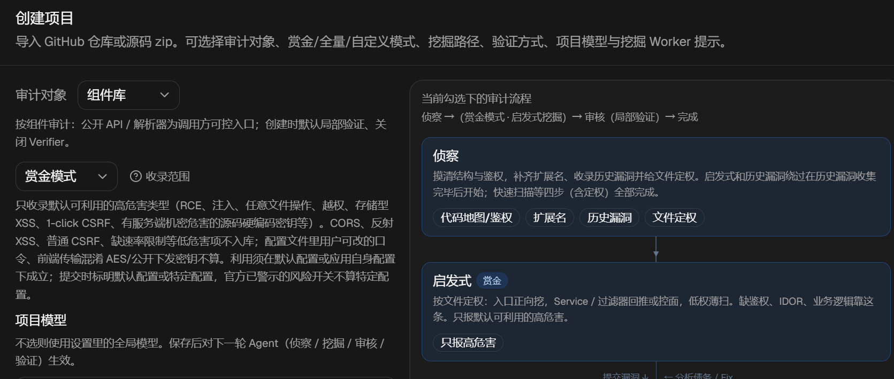

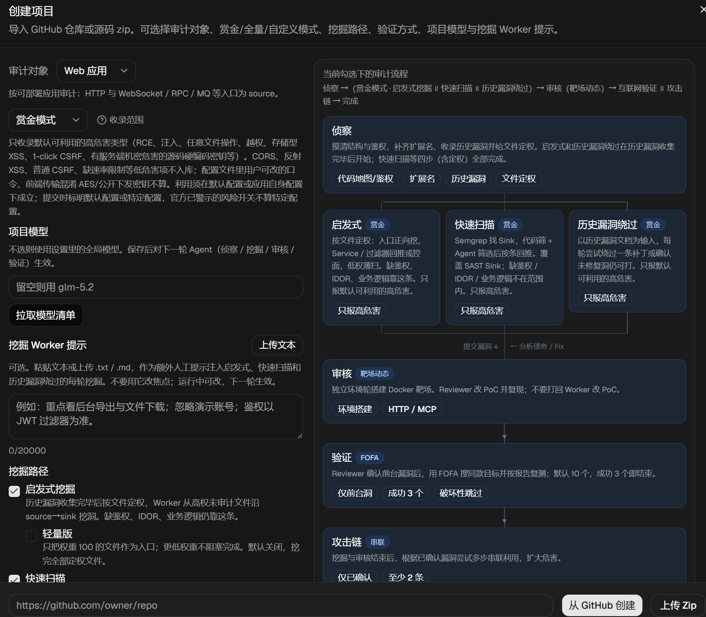

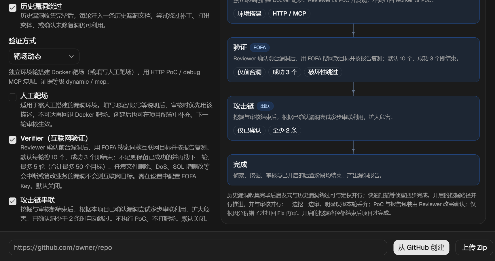

任务详情页面：SSE 实时日志、阶段报告、运行中动态配置。允许实时注入用户指令，或对任意阶段新开。

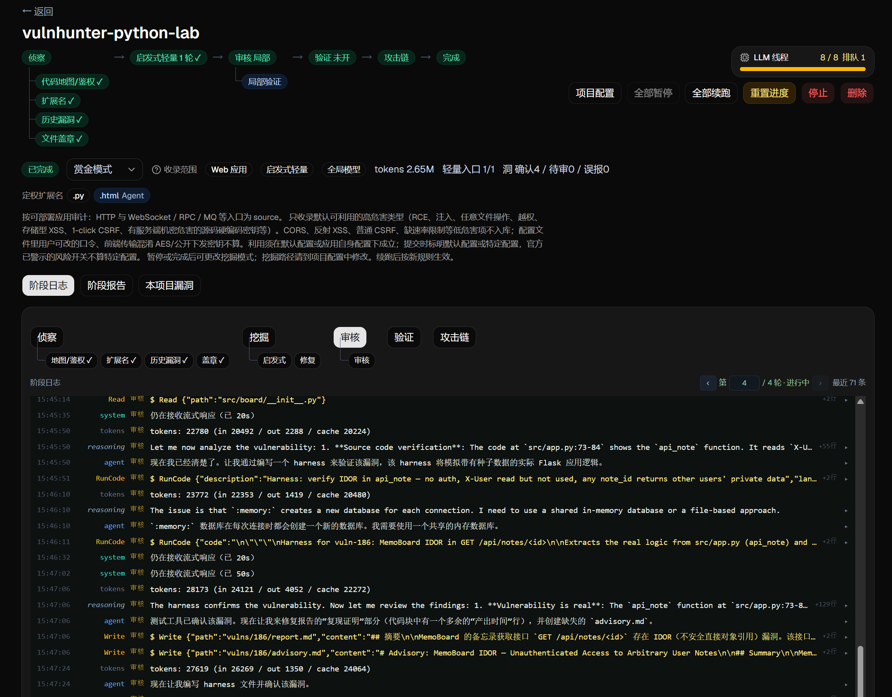

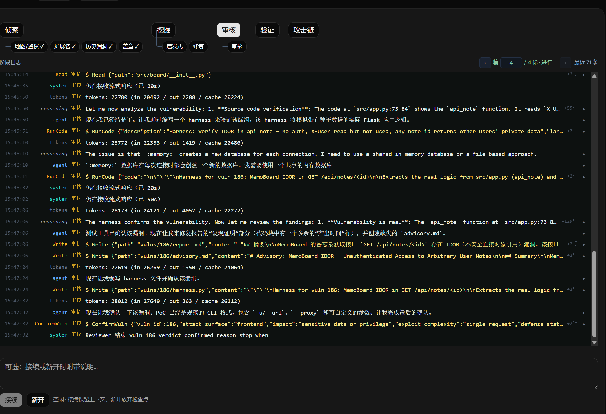

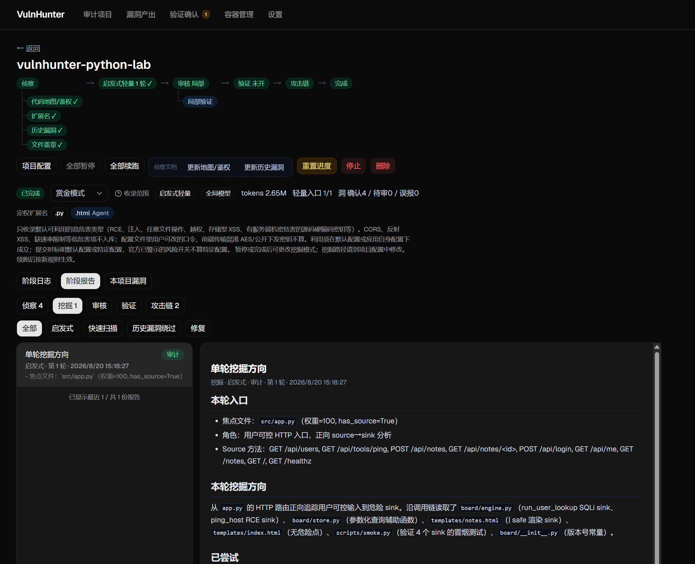

互联网验证确认页面：对可能产生危害的漏洞进行人工干预。

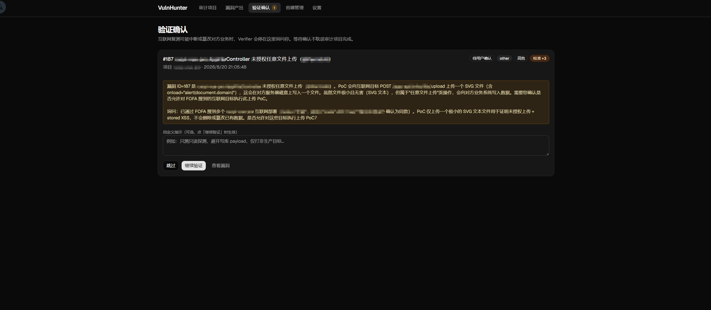

漏洞产出页面：验证形式（静态 / 动态 / 局部）、权限（前台 / 后台）、互联网复现情况。报告支持普通格式、advisory格式、CVE Json格式。可追问报告。

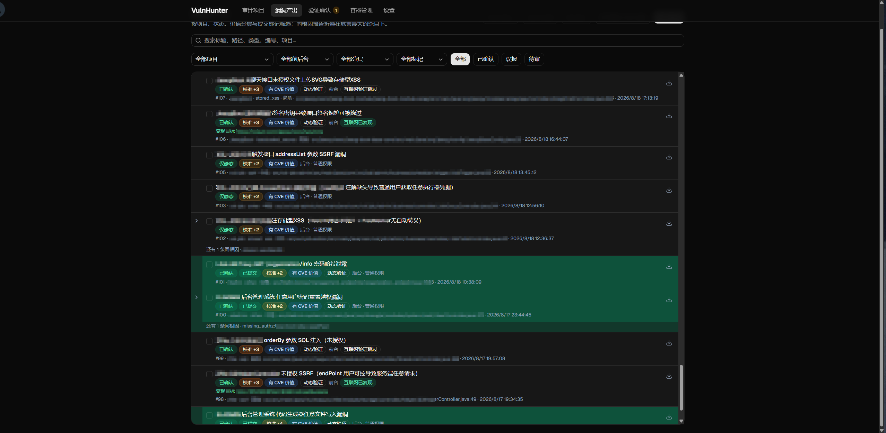

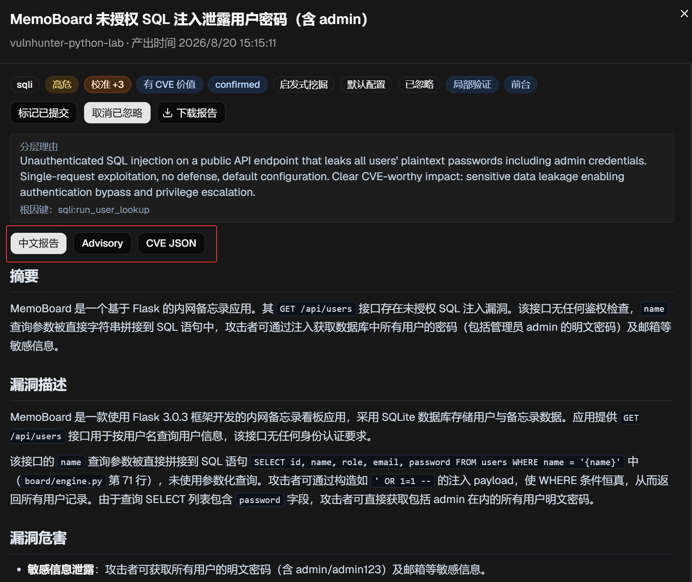

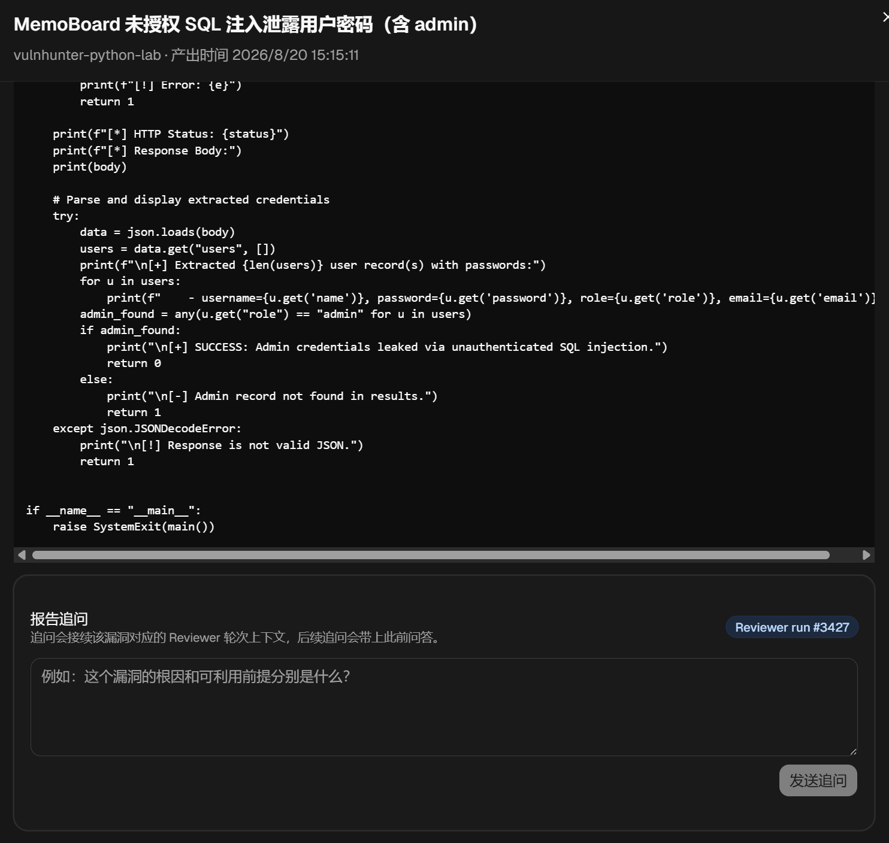

容器管理页面：监测动态复现时启动的容器。

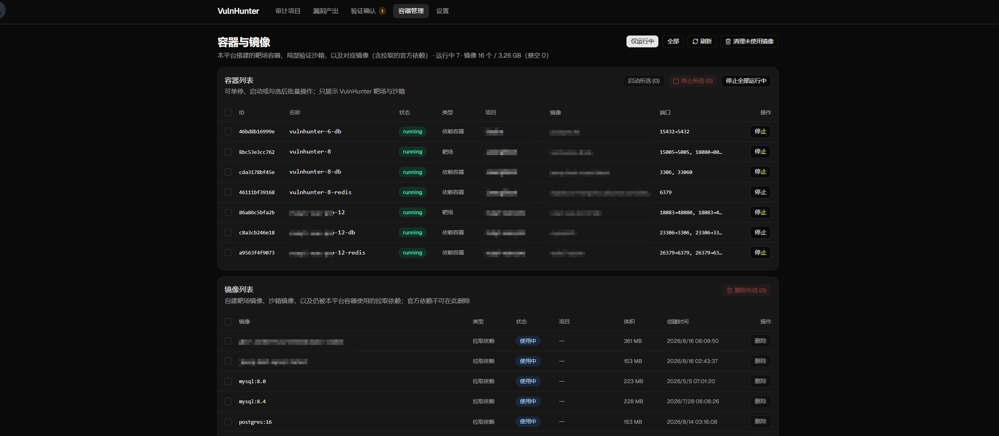

设置页面：Chat Completions / Anthropic Messages、自定义挖掘提示词、日志清理等。（当前模型商主要测试过 GLM、DeepSeek、百炼）

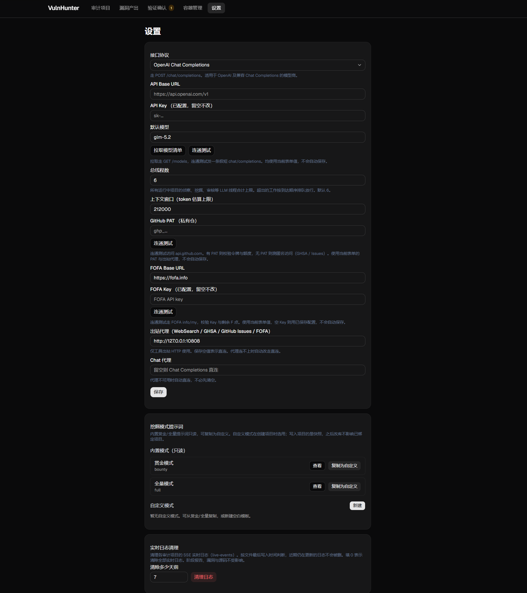

---

## 3. 白盒 Agent 设计要点

本节概括白盒 Agent 的共性设计问题。具体在本项目中的落地方式见第 4 节。

### 3.1 角色拆分

白盒审计上下文长、子任务差异大，通常拆成多个角色：**编排器、侦察器、挖掘器、验证器**（以及修复、互联网验证、攻击链等专项角色）。各角色使用独立提示词与工具 ACL，避免单会话上下文膨胀。

### 3.2 工具要有边界

- **按角色启用工具集**：侦察阶段不应调用 `SubmitVuln`，审核阶段不应随意 `Write` 源码。
- **权限与 hook**：Shell 禁止破坏项目工作区；Read/Grep 限制在工作区内；危险操作需门闩或人工确认。

### 3.3 审计流程与覆盖率

常见做法是由扫描器结果或 Agent 自由选点。本项目采用**文件定权 + 按权重排队**：确保全量覆盖，并对不同角色文件使用不同挖掘策略（正向 source→sink、回推、控面、薄扫）。

### 3.4 项目状态由谁管

任务结束可以交给 Agent 自行 `finish`，也可以由**代码状态机 + 落盘文件**约束。对于需要全覆盖的场景，必须防范 LLM「偷懒提前收工」，因此关键进度（如定权文件是否全部 `FinishFile`）由代码判定。

### 3.5 把 LLM 当作不可靠组件

模型可能返回畸形工具调用、多轮重复同一调用、长时间纯文字无进展、各厂商 429/超时。需要：**看门狗提醒、死循环拦截、超时抢救（Conclude）、检查点续跑、上下文压缩、全局 LLM 线程池排队**。

### 3.6 产物要结构化

漏洞、历史洞、攻击链、阶段摘要等均通过**专用工具落盘**，便于代码判定阶段完成、去重合并、前端展示与人工审查。

---

## 4. VulnHunter-White 设计分析

以下按「创建 GitHub 项目 → 审计完成」的顺序说明设计考量。默认流程：**Recon → 挖掘（启发式 / 快速扫描 / 历史漏洞绕过，至少一条）→ Reviewer → 可选 Verifier / 攻击链**。

### 4.1 工具集

通用工具（定权、Sink 筛选等原子阶段有独立工具集，此处不列）：

| 工具 | 用途 |
| --- | --- |
| Read | 读取单个或多个文件内容 |
| Glob | 按模式列出文件 |
| Grep | 搜索代码片段、关键字、函数、危险调用 |
| Write | 写入审计过程中的产物或辅助材料 |
| Bash | 在允许时执行 shell 命令 |
| PowerShell | 在允许时执行 PowerShell 命令 |
| TodoWrite | 维护运行时待办；每 50 轮自动注入上下文，压缩后自动注入 |

运行时 Bash 与 PowerShell **只注入本机原生的那一个**。

### 4.2 编排策略与状态管理

**代码负责总编排**；阶段内流转多数由 Agent 调用工具触发，部分关键节点由代码硬约束：

| 机制 | 由谁决定 |
| --- | --- |
| 侦察鉴权文档是否完成 | 检测文档落盘 |
| 启发式单轮结束 | Agent 调用 `FinishRound` |
| 启发式全部结束 | 代码：所有定权文件已 `FinishFile`（或跳过） |
| 项目 completed | 代码：各开启挖掘路径结束 + 审核队列清空 + 可选 Verifier/攻击链闸门 |

这样既保留 Agent 灵活性，又对**全覆盖、不误报堆积**施加硬约束。

### 4.3 容错与恢复机制

#### 检查点与续跑

1. 检查点落在 `workspace/checkpoints/`，保存消息、看门狗和限流计数；暂停或进程中断后按原上下文续跑。改挖掘模式或验证方式会丢弃对应检查点，续跑后按新规则新开。
2. 超时、429 用尽或死循环退出前先 **Conclude 抢救**（默认 1800s），摘要落到 `docs/summaries/{phase}-rescue`，下一轮注入后续跑。普通阶段最多再开 2 次，侦察最多 8 次（对应四个小阶段）。Conclude 选取最近 100 轮消息，截断后注入 TodoList 再摘要，并额外写入完整 TodoList。
3. 请求超过上下文窗口 85% 时主动压缩，新开上下文并注入 Conclude；启发式再注入最近最多 10 轮 `worker-round-N.md` 摘要。Worker 认领超过约 7200s 视为过期，可被回收另派。

#### 超时与限流

4. 各阶段墙钟超时：侦察 3600s，盖章轮 1800s，Worker 一轮 7200s，审核静态 1800s，靶场动态再加 Docker 1800s，Verifier / 攻击链 / Semgrep / Sink 筛选各 1800s。每阶段最多超时 2 次，此后抢救落盘并保留基本产出（如审核默认降级为仅静态）。
5. LLM 429 休眠 90s 再试，最多 20 次，进程级全局共享冷却；其它瞬时失败最多退避 3 次。全局 LLM 线程上限默认 6，满则按到达顺序排队。

#### 工具执行容错

6. 工具调用失败把 error 回给模型；本地执行失败另记 `tool-exec-errors.jsonl`。上一轮工具已调用但失败时，下一轮纯文字会提醒按错误改参，不要原样重试。
7. Shell 默认 120s、最多 180s，另有硬超时。出站 HTTP / Chat 代理连不上时自动改走直连。

#### 看门狗提醒

8. 无工具调用的纯文字轮立刻提醒改用工具；有一次真工具调用后连续无工具计数清零。门闩满足后系统自己结束本轮。
9. 连续 4 次同一工具且参数不变则拦截并重置窗口；同一轮死循环窗口触达 5 次则终止本轮。
10. 历史漏洞落盘 / 补漏连续 50 轮未 `WriteOldVuln`、扩展名连续 50 轮未 `AddSourceExt` 则催落盘；代码地图 / 鉴权轮不催。
11. 启发式连续 50 轮未 `FinishFile`、快速扫描未 `FinishSink`、绕过未 `FinishBypass`、Sink 筛选未 `FinishSinkTriage` 则催收工；`Read` / `Grep` 不计入空闲。CLI 静默索引连续 8 轮未 `FinishIndex` 则催落盘描述。

#### 审核与验证闸门

12. 同一条待审漏洞连续超时 2 轮后，下一轮强制仅静态审核，并隐藏 Shell、`RunCode`、`CollectLabFingerprints`。打回上限为 1，超过直接标误报。
13. `SubmitVuln` / `ConfirmVuln` 碰到同文件同类型或同根因时先软提醒；本会话被提醒过一次后，再带 `confirm_not_duplicate` 才放行。
14. 局部验证沙箱不可用或 mock 失败不因此误报，静态已能证明则可 `static_only` 确认。Verifier 遇到破坏性复测会 `AskUser` 挂起，在「验证确认」页等待指示，不阻塞项目完成。

### 4.4 侦察阶段

#### 4.4.1 代码地图与鉴权（recon）

| 工具 | 用途 |
| --- | --- |
| MarkSource | 标记用户可控入口，自动权重 100 |
| FinishReconMap | 仅地图重跑：写回代码地图与鉴权文档后结束会话 |

至少需要两份落盘文档：

- **代码地图**：项目概述、技术栈、模块划分、HTTP 入口、非 HTTP 入口（WebSocket / RPC / MQ / 回调等）、关键依赖。
- **鉴权分析**：角色与资源、鉴权链路，决定后台洞能否升级为前台洞，并辅助越权挖掘。

#### 4.4.2 扩展名（recon_source_ext）

| 工具 | 用途 |
| --- | --- |
| AddSourceExt | 把默认未入库的执行面文件补进索引 |

根据代码地图补充需审计的扩展名。

#### 4.4.3 历史漏洞收集

**爬虫落盘（recon_old_vuln）** — 禁止 WebSearch，不读源码：

| 工具 | 用途 |
| --- | --- |
| WriteOldVuln | 逐条写入历史漏洞文档并更新索引 |
| SearchOldVuln | 查已落盘条目，避免重复写 |

**搜索补漏（recon_old_vuln_ghsa）**：

| 工具 | 用途 |
| --- | --- |
| WebSearch | 按本项目产品名补搜公开 CVE / 公告 |
| SearchGHSA | 公开公告不足时查 GitHub Advisories |
| SearchGitHubIssues | 本仓库未关闭 Issues，作为未修复洞来源 |
| WriteOldVuln / SearchOldVuln | 补漏命中立刻落盘 / 去重 |

已修复洞（`patched`）用于绕过尝试；未修复洞（`unpatched`，主要来自 Issues）用于挖掘去重。

#### 4.4.4 文件定权（recon_mark）

| 工具 | 用途 |
| --- | --- |
| MarkSource | 标记用户可控入口，自动权重 100 |
| MarkWeight | 给文件打 0–100 审计权重 |
| MarkSkip | 跳过测试 / 生成代码等文件 |

定权策略与挖掘方向：

| 角色 | 方向 |
| --- | --- |
| 权重 100 / has_source | 正向 source→sink（含非 HTTP） |
| 过滤器 / 鉴权 | 控面（匹配、绕过、失败开放） |
| Service | 危险操作与鉴权缺口，回推 caller / 二阶 |
| Util / Mapper / 模板 | 执行面或 sink 回推 |
| DTO / 常量 / 死代码 | 薄扫后收工 |

初始上下文为代码地图 / 鉴权文档；每批传入 150 个文件名，由 Agent 调用 Mark 系列工具定权。

### 4.5 挖掘阶段

#### 4.5.0 漏洞挖掘模式

- **赏金模式（默认）**：只挖掘高危漏洞，不报告反射 XSS、CORS 安全头等低危害项。
- **全量模式**：报告低危害漏洞。
- **自定义模式**：在设置页用自然语言描述挖掘范围，项目选用时快照正文，无赏金硬闸门。

#### 4.5.0b 审计对象（target_kind）

与挖掘模式正交，创建时选定（暂停/完成可改）：

- **Web 应用（默认）**：HTTP / 非 HTTP 入口为 source，行为与历史版本一致。
- **组件库**：公开 API / 解析器 / SPI 为调用方可控入口；验证默认偏 harness；通常关闭 FOFA Verifier。
- **混合**：优先挖库核心；demo/sample/examples 降权。提示词包见 `prompts/target_kinds/`。

#### 4.5.1 启发式挖掘（worker）

| 工具 | 用途 |
| --- | --- |
| SubmitVuln | 提交待审核漏洞 |
| AppendAffectedLocations | 向已有待审报告追加同根因受影响点 |
| FinishFile | 标记文件不必再作为后续轮次焦点 |
| FinishRound | 焦点文件分析完后结束本轮 |
| FinishFix | 打回轮纠正入口 / sink / 根因后重新入队 |

**创新点：按定权文件排队，而非 Agent 自由选点。** 权重从高到低，每文件一轮；每轮产出 `worker-round-N.md` 摘要，后续轮注入最近 10 轮摘要，避免重复尝试。

**轻量开关**：只把权重 100 的文件当入口，降低 token 消耗。

**AppendAffectedLocations**：同根因多受影响点合并为父子报告集合，避免重复报告又不丢信息。

#### 4.5.2 历史漏洞绕过（bypass_worker）

| 工具 | 用途 |
| --- | --- |
| SubmitVuln | 绕过补丁或确认未修复洞仍可打时提交 |
| AppendAffectedLocations | 追加同根因受影响点 |
| FinishBypass | 结束本轮注入的这一条历史漏洞 |

数据源为侦察阶段 `docs/old-vulns/`；每轮注入一条历史漏洞文档，产出绕过摘要。对应手挖时「先复现历史洞再尝试绕过补丁」的工作习惯。

#### 4.5.3 快速扫描

**Sink 筛选（sink_triage）**：

| 工具 | 用途 |
| --- | --- |
| FinishSinkTriage | 提交本批 Sink 的 keep / drop / defer |

**快速扫描 Worker（fast_worker）**：

| 工具 | 用途 |
| --- | --- |
| SubmitVuln | 按本轮 Sink 回推后提交 |
| AppendAffectedLocations | 追加同根因受影响点 |
| FinishSink | 结束本轮注入的 Sink |

三步流水线：**Semgrep（纯代码，最多 200 条）→ Agent 精筛（最多 60 条）→ 按 Sink 回推 source**。快速路径覆盖 SAST Sink；鉴权 / IDOR / 业务逻辑仍靠启发式。

#### 4.5.4 报告修复（fix）

Reviewer 仅在入口 / sink / 根因分析错误时 `ReturnToWorker`；PoC 与报告包装由 Reviewer 收口，一般不打回 Worker 改 PoC。Fix Worker 用于纠正分析债务。

### 4.6 审核阶段

创建项目时三选一：**纯静态（默认）**、**靶场动态**、**局部验证（harness）**。

#### 4.6.1 靶场搭建（reviewer_lab）

| 工具 | 用途 |
| --- | --- |
| FinishLab | 结束独立 Docker 靶场搭建轮 |

开启靶场动态验证时，项目开始即搭建 Docker 环境；镜像 `{项目名}-{id}:lab`，Web 容器 `{项目名}-{id}`。**被测应用必须使用导入的 `src/` 当前代码**，禁止换成旧发行版镜像。

#### 4.6.2 靶场验证（reviewer）

| 工具 | 用途 |
| --- | --- |
| ConfirmVuln | 确认漏洞并校准严重度与价值分层 |
| MarkFalsePositive | 判定误报 |
| ReturnToWorker | 仅入口 / sink / 根因分析错误时打回 |
| MergeIntoVuln | 同根因同危害重复报告并入主报告 |
| CollectLabFingerprints | 从靶场升级项目共享指纹 |
| SearchTools | 搜索已索引的用户 CLI |
| SearchGHSA / SearchOldVuln | 查公告与已提交报告 |

要点：

- 靶场可用时 **ConfirmVuln 会系统再执行落盘 `poc.py`**（`python poc.py -u <target_url>`），退出码非 0 则拒绝确认。
- PoC 由 Reviewer 收口；缺失或跑不通且需改写时才用 **Java / Node / Python debug MCP**。
- `SearchTools` 检索 `tools/cli` 下用户放置的 CLI（如 JNDI、恶意 JDBC 服务），按绝对路径 Shell 执行。

#### 4.6.3 局部验证（harness）

在 `vulnhunter/sandbox:latest` 沙箱中执行 `RunCode` 写入的 `harness.py`，思路类似「抽出可疑函数 + mock 驱动 payload」，成本低但无法证明完整 HTTP 链路与 classpath 复杂场景。确认后 `evidence_level=harness`。

#### 4.6.4 静态验证

Reviewer 复核数据流是否用户可控、防护是否有效、权限标注是否正确；`evidence_level=static_only`。

### 4.7 互联网验证（verifier）

| 工具 | 用途 |
| --- | --- |
| FofaSearch | 只读 FOFA 测绘同款前台目标 |
| AskUser | 破坏性复测前询问用户 |
| FinishVerifier | 提交结论并结束本轮 |

对已确认**前台**漏洞：按项目级指纹（`docs/app-fingerprints.json`）FOFA 搜索，默认每批 10 个、成功 3 个即结束，最多 5 轮（合计最多 50 目标）。命中目标项目内共享；0 条可改写语法最多 3 次。破坏性操作 `AskUser`，在「验证确认」页 Human-in-the-loop，**不阻塞项目完成**。

### 4.8 攻击链串联（attack_chain）

| 工具 | 用途 |
| --- | --- |
| SearchOldVuln | 仅搜索本项目已确认产出 |
| SubmitAttackChain | 提交详文攻击链（最多 3 条） |
| IndexAttackChain | 其余真链写入索引简述 |
| FinishAttackChain | 结束阶段（有链或无链都必须调用） |

挖掘与审核结束后，根据已确认漏洞尝试多步串联；优先危害最大、利用最简单的链写详文，其余一句话索引。

### 4.9 流水线总览

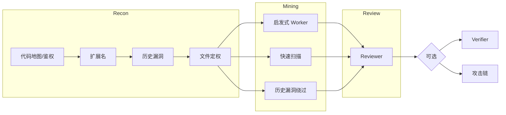

---

## 5. 挖掘成果

目前申请编号的流程尚未走完，此处仅作概览。

已在多个 Java / Python 项目（低代码平台、AI 网关、网盘、博客等）上试跑：

- 漏洞类型以 XSS、SSRF、越权为主；高危相对较少，最高危为前台 SQL、后台提权等。
- 赏金模式下每个项目约 3–40 条产出，误报与低质量报告较少。
- Token 消耗约 1 亿–10 亿；启发式轻量模式约 1 亿–3 亿。

---

## 6. 不足之处

1. **暂不支持 Docker 一键部署**：动态靶场依赖宿主机 Docker，容器内无法再启 Docker；目前以本地应用方式运行，或部署时关闭动态验证。
2. **模型商覆盖有限**：主要测试官方 GLM、DeepSeek、百炼；中转站模型未系统验证。
3. **历史漏洞覆盖率无硬保证**：偏 GitHub / GHSA / WebSearch，依赖公开情报质量。

---

## 7. 漏洞评级附录

总分 ≥5 为严重，3–4 为高危，1–2 为中危，≤0 为低危。

| 维度 | 取值 | 分 | 怎么来的 |
| --- | --- | --- | --- |
| 可达性 | 未认证可达 | +1 | `attack_surface=frontend`（前台） |
| | 低权限可达 | +0 | 后台 + `required_account=user` |
| | 管理员才可达 | -1 | 后台 + `required_account=admin` |
| 影响范围 impact | RCE / 全库 / 完整控制 | +4 | `rce_or_full_data` |
| | 敏感数据 / 权限提升 / 部分数据 | +2 | `sensitive_data_or_privilege` |
| | 有限信息泄露 / 信息收集 | +1 | `limited_info` |
| 利用复杂度 exploit_complexity | 单请求或简单触发 | +1 | `single_request` |
| | 多步骤利用 | +0 | `multi_step` |
| | 依赖特定环境 | -2 | `specific_environment` |
| 防护状态 defense_status | 无有效防护 | +0 | `none` |
| | 有防护但可绕过 | +0 | `bypassable` |
| | 有防护且绕过需额外条件 | -1 | `conditional` |

---

## 8. 总结

白盒 Agent 中的容错与恢复机制（工具调用提醒、超时抢救、检查点续跑、结构化产物）同样适用于通用 Agent 系统。欢迎测试、提 Issue / PR 或在此基础上二开；若挖到高质量漏洞，也欢迎反馈以便补充成果列表。

---

## 9. 相关链接

- 项目仓库：<https://github.com/1diot9/VulnHunter-White>
- Java debug MCP：<https://github.com/1diot9/Java-debug-mcp>
- Node debug MCP：<https://github.com/1diot9/Node-debug-mcp>
- Python debug MCP：<https://github.com/1diot9/Python-debug-mcp>
